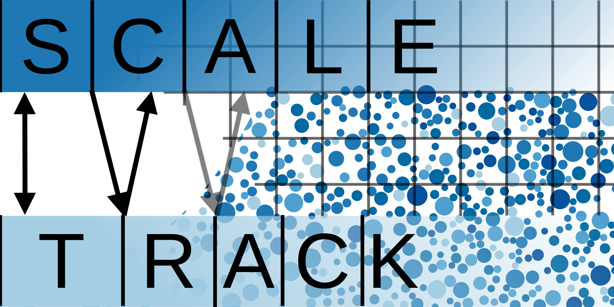

<p align="center">
  
</p>

# SCALE-TRACK

Asynchronous two-way coupled Euler-Lagrange particle tracking on heterogeneous
architectures.

The continuous phase is solved by OpenFOAM on CPUs.  The dispersed phase — up
to billions of parcels — is tracked in Julia on GPUs.  What makes the two run
at once is the coupling: the tracking does not wait for the Eulerian solve and
the Eulerian solve does not wait for the tracking.  The source terms the
carrier needs between two tracking steps are extrapolated, and the Lagrangian
phase is decomposed independently of the Eulerian one, so neither
decomposition constrains the other.

## What is here

| Path | |
|---|---|
| `src/scaleTrack/` | the tracking library, in Julia |
| `src/intermediateST_250321/` | a fork of OpenFOAM's intermediate Lagrangian library, with a droplet parcel that exchanges heat and vapour mass |
| `sol/` | the solvers, in pairs: `*JuliaParcelFoam*` couples to the tracking library, `*ParcelFoam*` is the pure-OpenFOAM reference |
| `run/` | cases, each with `Allrun` to run both solvers and `Allcheck` to judge the two against each other |
| `test/` | the checks that need neither OpenFOAM nor a GPU |

The solvers come in pairs on purpose.  Every claim about the coupled result is
made against the same physics solved the ordinary way, in one stack,
synchronously — so a disagreement is attributable.

## Building

Needs a sourced OpenFOAM environment (openfoam.com/ESI) and `julia` on `PATH`.

```sh
./Allwmake
```

**The precision has to match across the language boundary.**  The solvers are
built single precision with 32-bit labels, because the tracking library
defines its scalar as `Float32` and its label as `Int32`.  The fields are
shared by pointer, so a mismatched build corrupts data rather than failing to
link.

## The Julia environment

One environment for the whole repository, instantiated once from the root:

```sh
julia --project=. -e 'using Pkg; Pkg.instantiate()'
julia --project=. -e 'using MPIPreferences; MPIPreferences.use_system_binary()'
```

The second command points MPI.jl at the same MPI the solvers were built
against, and is not optional for a parallel run.  The solvers find the
environment by walking up from the case directory, so a case carries nothing.

## Running a case

```sh
cd run/buoyantHumidPimpleParcelFoam/hotRoom
./Allrun      # both solvers, on the same case
./Allcheck    # compares them, non-zero exit on failure
./Allclean
```

`Allcheck` accounts for the two things any such comparison must: the coupling
is asynchronous, so the tracking trails the reference by a step or two and the
offset is found rather than assumed; and a quantity starting from zero has no
scale of its own, so tolerances are relative to the peak of the series.

## Testing

```sh
julia --project=. test/runtests.jl
```

Runs anywhere — no OpenFOAM, no GPU, a few minutes.  Three of the checks are
verification against analytic or accurately-integrated references, one holds
the result independent of the thread count, and one is a regression against a
recorded checksum.  CI runs them on every push, together with a formatting
check.  `test/gpuExecutorCheck.jl` sits beside them but needs a device, so the
suite leaves it to be run by hand.

## Citing

See `CITATION.cff`.  If you use this software, please cite the paper as well
as the code.

## Licence

GPL-3.0-or-later; see `LICENSE`.  `src/intermediateST_250321` is a fork of
OpenFOAM code and carries the copyright of the OpenFOAM Foundation and OpenCFD
Ltd. alongside this project's.

OPENFOAM is a registered trademark of OpenCFD Limited, producer of the
OpenFOAM software.  This offering is not approved or endorsed by OpenCFD
Limited.
